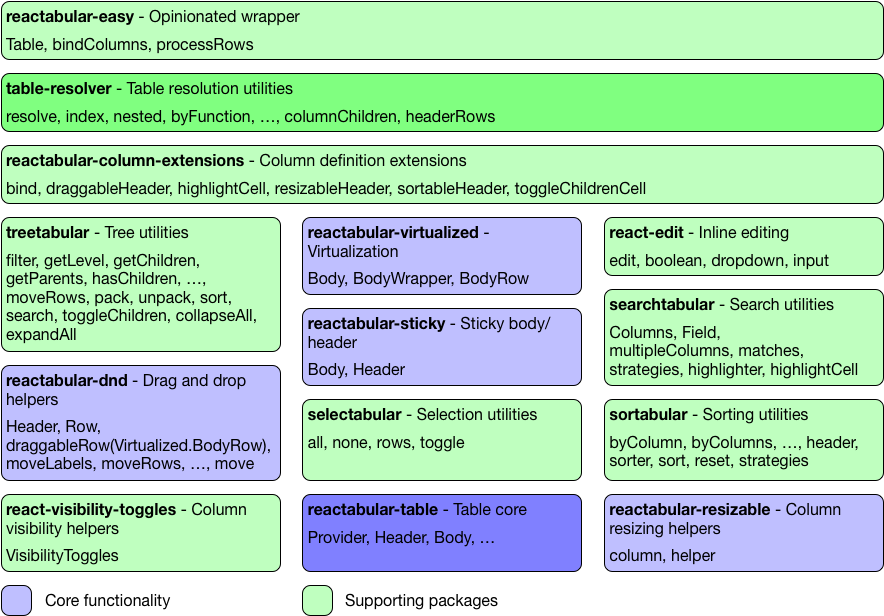

[](https://gitter.im/reactabular/reactabular) [](http://travis-ci.org/reactabular/reactabular) [](https://www.bithound.io/github/reactabular/reactabular) [](https://codecov.io/gh/reactabular/reactabular)

# Reactabular - Spectacular tables for React

Reactabular has been designed to be extensible. Rather than implementing a lot of functionality in its core, it provides extension points. You can, for instance, customize rendering on cell level. It is possible to implement functionality, such as search, pagination, sorting, and inline editing, through composition. The library includes a variety of utilities for this even though you may use third party ones as well.

By default Reactabular operates using a column and a data definition. It doesn't care where those come from. It just renders the table for you. This means Reactabular will fit right into your current data architecture. It doesn't constrain it in any manner.

The chosen approach pushes a lot of complexity out of the core. As a result it might take more code to achieve certain functionalities. This is the price of flexibility. And that's the primary design goal of Reactabular.

> If you want to learn more about React, read [SurviveJS - Webpack and React](http://survivejs.com/).

## Example

The following example illustrates the approach used by Reactabular:

```jsx
/*
import * as Table from 'reactabular-table';
*/

const rows = [
  {
    id: 100,
    name: 'John',
    tools: {
      hammer: true
    },
    country: 'fi'
  },
  {
    id: 101,
    name: 'Jack',
    tools: {
      hammer: false
    },
    country: 'dk'
  }
];
const countries = {
  fi: 'Finland',
  dk: 'Denmark'
};

const columns = [
  {
    property: 'name',
    header: {
      label: 'Name',
      transforms: [
        label => ({
          onClick: () => alert(`clicked ${label}`)
        })
      ]
    }
  },
  {
    property: 'tools',
    header: {
      label: 'Active',
      transforms: [
        label => ({
          onClick: () => alert(`clicked ${label}`)
        })
      ]
    },
    cell: {
      formatters: [
        tools => tools.hammer ? 'Hammertime' : 'nope'
      ]
    }
  },
  {
    property: 'country',
    header: {
      label: 'Country',
      transforms: [
        label => ({
          onClick: () => alert(`clicked ${label}`)
        })
      ]
    },
    cell: {
      formatters: [
        country => countries[country]
      ]
    }
  },
];

<Table.Provider
  className="pure-table pure-table-striped"
  columns={columns}
>
  <Table.Header />

  <Table.Body rows={rows} rowKey="id" />
</Table.Provider>
```

## Available Packages

The following image shows roughly what packages are available. You will need to install them individually based on your needs. It is possible to use packages beyond these, but the ones listed below are maintained within the Reactabular organization:



## Testimonials

> If you've struggled with other React table components, you'll see why this one is the best! - [Tim Dorr](https://twitter.com/timdorr/status/750346565374455808)

> It’s not a regular table component it’s a whole framework to work with tables: sorting, drag’n’drop, filtering, etc. And it’s easy to change every part if you need something specific. - [Artem Sapegin](http://sapegin.me/)

If you are using Reactabular and want to endorse it, [let me know](https://github.com/reactabular/reactabular/issues/new).

## Sponsors

[](http://survivejs.com/) [](http://www.kenandy.com/)

## License

MIT. See LICENSE for details.
